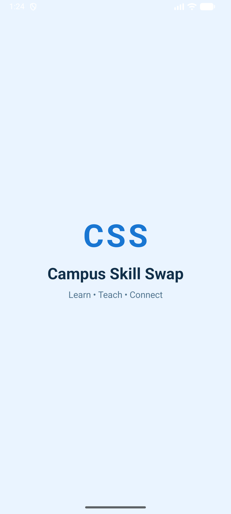
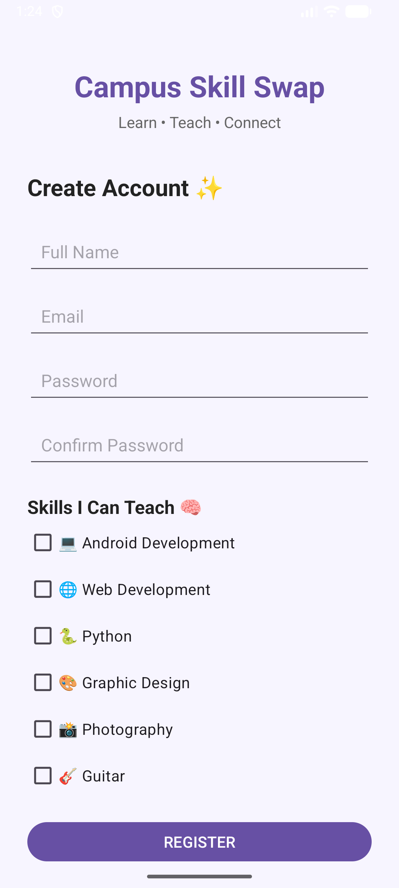
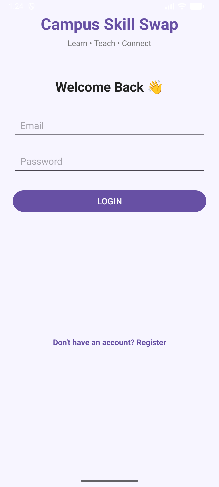
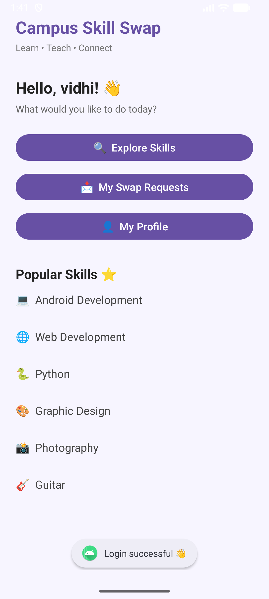
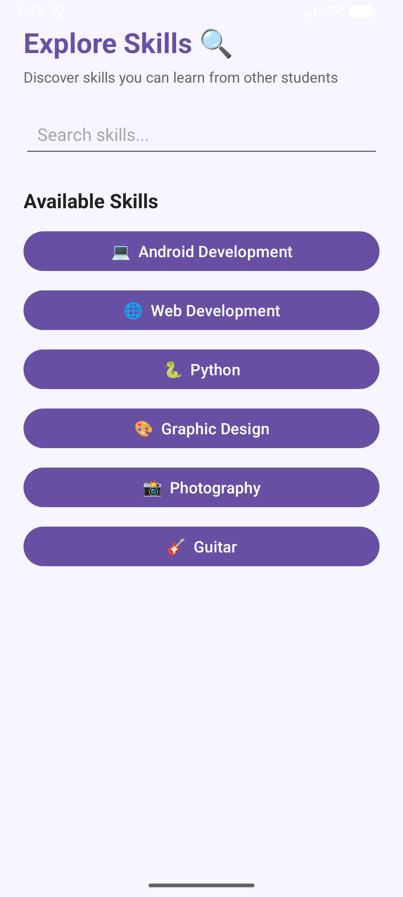
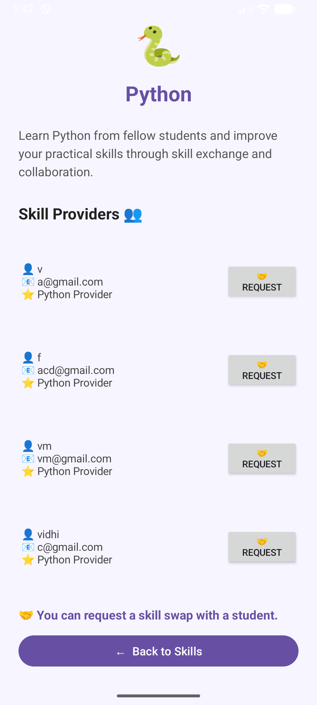
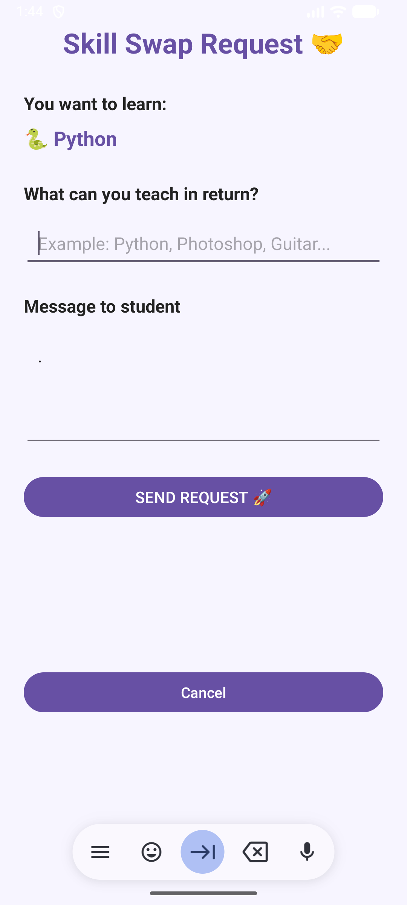
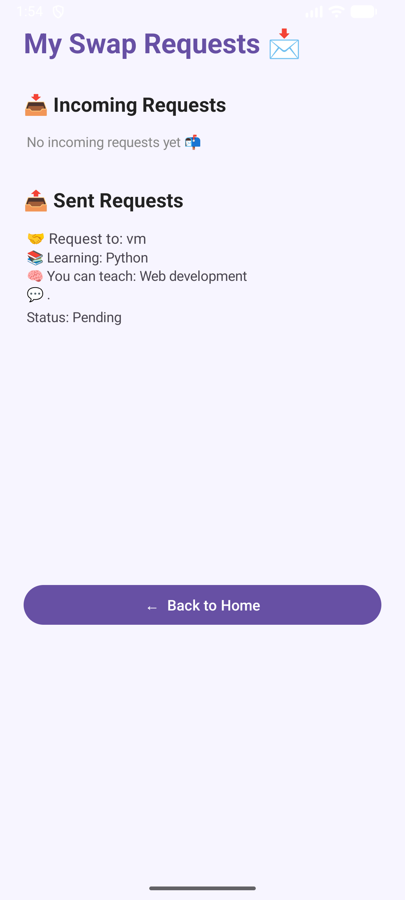
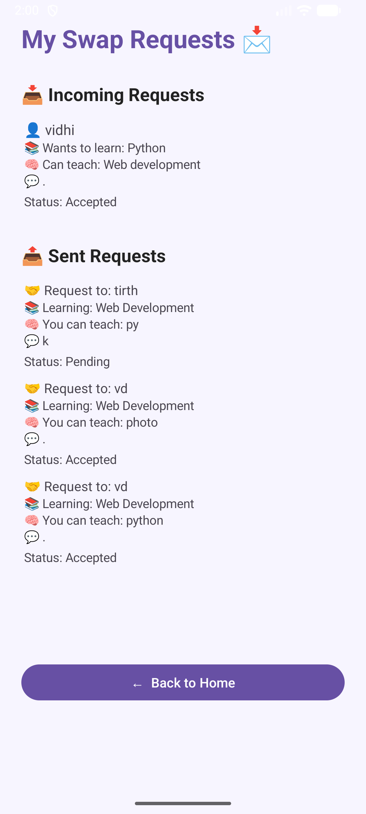
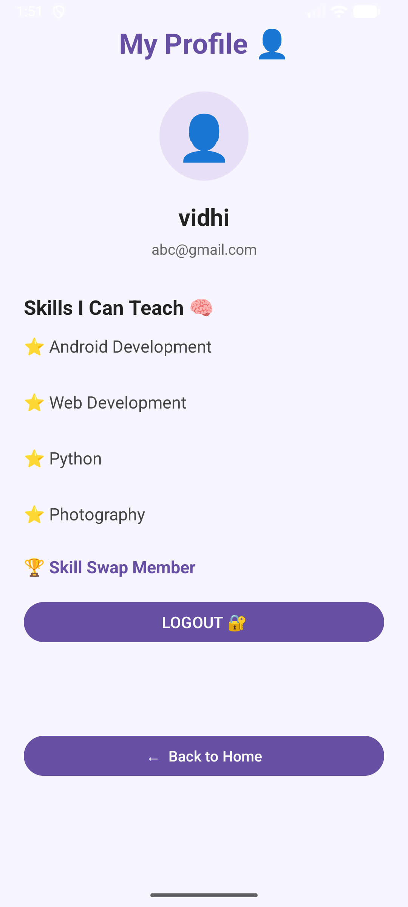

# Campus Skill Swap: A Student Skill Exchange Platform

## AIM & Objective

To develop an Android application that allows college students to connect with each other, share their skills, discover students who can teach specific skills, and send skill swap requests within the campus community.

The application provides a simple platform where students can teach skills they know and learn new skills from fellow students through skill exchange.

---

# Project Overview

Campus Skill Swap is an Android-based Skill Exchange application developed for college students.

The application allows users to:

- Create a student account
- Select skills they can teach
- Login to the application
- View a personalized Home Dashboard
- Explore available skills
- Search for skills
- View students who can teach a selected skill
- Send skill swap requests
- Specify the skill they can teach in return
- Add a message with the request
- Receive incoming skill swap requests
- Accept or reject incoming requests
- View sent request status
- View profile details
- Logout from the application

---

# Main Features

## 1. Account Management

- Student Registration
- Login Authentication
- Account-specific user information
- Skill selection during registration
- Profile Details
- Logout Functionality

## 2. Student Registration

During registration, users enter:

- Name
- Email
- Password
- Confirm Password

Users can also select the skills they can teach.

Available skills include:

- Android Development
- Web Development
- Python
- Graphic Design
- Photography
- Guitar

Each registered student is stored with their selected teaching skills.

## 3. Login

Registered users can login using:

- Email
- Password

After successful login, the application stores the current user's session information and redirects the user to the Home Dashboard.

## 4. Home Dashboard

The Home Dashboard provides access to the main features of the application.

Users can:

- Explore Skills
- View Skill Swap Requests
- Open Profile
- View popular skills
- Navigate through the application easily

## 5. Explore Skills

Users can explore different skills available in the application.

Available skills include:

- Android Development
- Web Development
- Python
- Graphic Design
- Photography
- Guitar

The Explore section also provides a search option to quickly find a particular skill.

## 6. Skill Providers

When a user selects a skill, the application searches the registered users stored on the device.

It displays students who have selected that skill as a skill they can teach.

Each provider displays:

- Student Name
- Email
- Skill they can teach
- Skill Swap Request option

The currently logged-in user is not displayed as their own skill provider.

## 7. Skill Swap Requests

Users can send a request to another student for learning a particular skill.

The request contains:

- Student sending the request
- Student receiving the request
- Skill to learn
- Skill the sender can teach
- Personal message
- Request status

## 8. Request Management

Users can manage both incoming and sent requests.

### Incoming Requests

The receiver can:

- View incoming requests
- See who sent the request
- See the skill they want to learn
- See the skill offered in exchange
- Read the request message
- Accept the request
- Reject the request

### Sent Requests

The sender can:

- View sent requests
- View receiver name
- View learning skill
- View offered teaching skill
- View request message
- Check request status

## 9. Request Status

| Status | Meaning |
|---|---|
| PENDING | Request is waiting for a response |
| ACCEPTED | Receiver has accepted the skill swap request |
| REJECTED | Receiver has rejected the skill swap request |

The request status is updated for both the sender and receiver.

---

# Output Screenshots

| Splash Screen | Login Screen |
|:---:|:---:|
|  |  |

| Registration Screen |
|:---:|
|  |

| Home Dashboard |
|:---:|
|  |

| Explore Skills |
|:---:|
|  |

| Skill Providers |
|:---:|
|  |

| Send Skill Swap Request |
|:---:|
|  |

| Incoming Request |
|:---:|
|  |

| Accepted Request - Receiver | Accepted Request - Sender |
|:---:|:---:|
|  |  |

| Profile Screen |
|:---:|
|  |

---

# Technology Used

| Technology | Purpose |
|---|---|
| Kotlin | Android application development |
| XML | User interface design |
| ConstraintLayout | Responsive screen layouts |
| Material Components | Modern Android UI components |
| ScrollView | Handling scrollable screen content |
| SharedPreferences | Local data storage and user session |
| JSON / JSONArray | Storing users and skill swap requests |
| Android Studio | Application development |
| Git and GitHub | Version control |

---

# UI Implementation Details

- **Application Type:** Android Application
- **Programming Language:** Kotlin
- **UI Technology:** XML
- **Layout:** ConstraintLayout
- **UI Components:** Android and Material UI components
- **Scrollable Screens:** ScrollView
- **Data Storage:** SharedPreferences
- **Data Format:** JSON / JSONArray
- **Application Theme:** Material-based UI
- **Request Status:** PENDING, ACCEPTED and REJECTED
- **Authentication:** Local email and password validation

---

# Application Working

## 1. Splash Screen

When the application starts, a splash screen is displayed with the Campus Skill Swap branding.

After a short delay, the user is redirected to the Login screen.

## 2. Registration

The user creates an account by entering:

- Name
- Email
- Password
- Confirm Password

The user then selects one or more skills they can teach.

The application validates the entered information and stores the account locally.

Duplicate email registration is also prevented.

## 3. Login

The user enters their registered email and password.

The application checks the entered credentials against the locally stored user information.

If the credentials are correct, the user is logged in and redirected to the Home Dashboard.

The current user's email and name are stored as the active session.

## 4. Exploring Skills

From the Home Dashboard, the user can open Explore Skills.

The user can select a skill such as:

- Android Development
- Web Development
- Python
- Graphic Design
- Photography
- Guitar

The Explore screen also provides a search field for finding skills quickly.

## 5. Viewing Skill Providers

After selecting a skill, the application searches the registered users.

Students who have selected the chosen skill as a teaching skill are displayed as Skill Providers.

The logged-in user is excluded from the provider list.

## 6. Sending a Skill Swap Request

The user selects a Skill Provider and opens the Skill Swap Request screen.

The user provides:

- Skill they want to learn
- Skill they can teach in exchange
- Personal message

After validation, the request is saved locally with a `PENDING` status.

## 7. Receiving Requests

The receiver can open the Requests section and view incoming requests.

Each request contains information about:

- Sender
- Skill to learn
- Skill offered in exchange
- Message
- Current status

For pending requests, the receiver can choose:

- Accept
- Reject

## 8. Updating Request Status

When the receiver accepts or rejects a request, the request status is updated in local storage.

The same updated status can then be viewed from the sender's Sent Requests section.

This demonstrates the complete skill swap request workflow.

## 9. Profile

The Profile section displays the logged-in user's:

- Name
- Email
- Teaching Skills

The user can also logout from the application.

After logout, the current login session is cleared and the user is returned to the Login screen.

---

# Data Storage

The current prototype uses Android SharedPreferences for storing application data.

The stored information includes:

- Registered user details
- User names
- User email addresses
- User passwords
- Selected teaching skills
- Current logged-in user
- Skill swap requests
- Sender information
- Receiver information
- Learning skill
- Teaching skill
- Request message
- Request status

User and request data are stored using JSON and JSONArray structures inside SharedPreferences.

---

# Local Authentication Approach

The current prototype implements local authentication.

During registration:

- User information is stored locally.
- Duplicate email registration is prevented.
- Selected teaching skills are saved with the user account.

During login:

- Email is compared with stored user information.
- Password is validated against the locally stored password.
- The current user's session is created after successful login.

This approach is suitable for demonstrating the application's functionality as a college project prototype.

**Author Name:** Vidhi Patel  
**Enrollment Number:** 24012011143  
**Project Name:** CampusSkillSwap  
